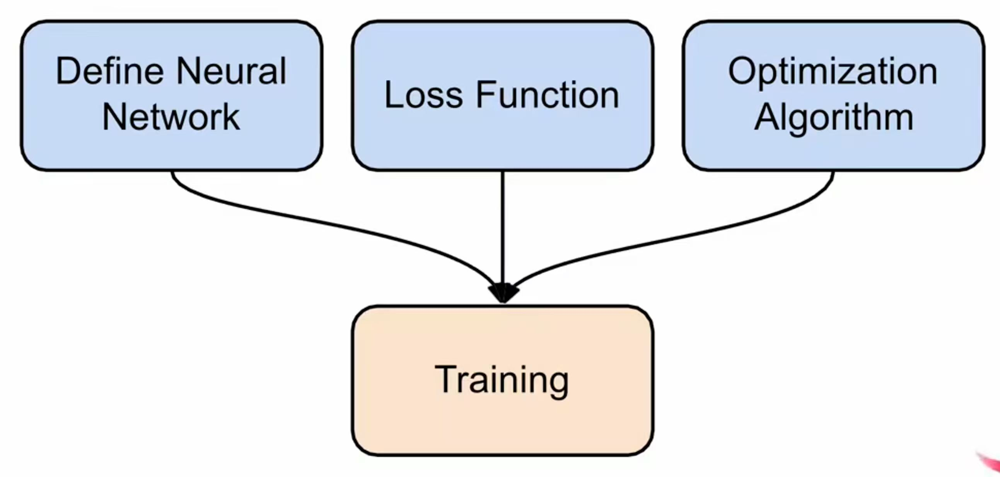
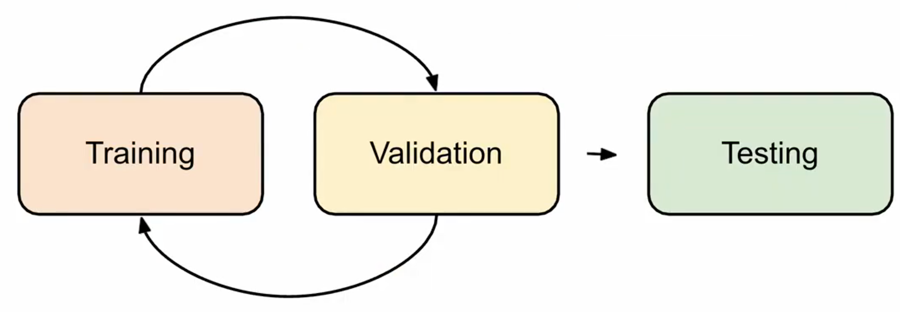
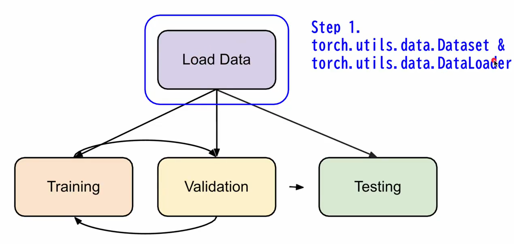
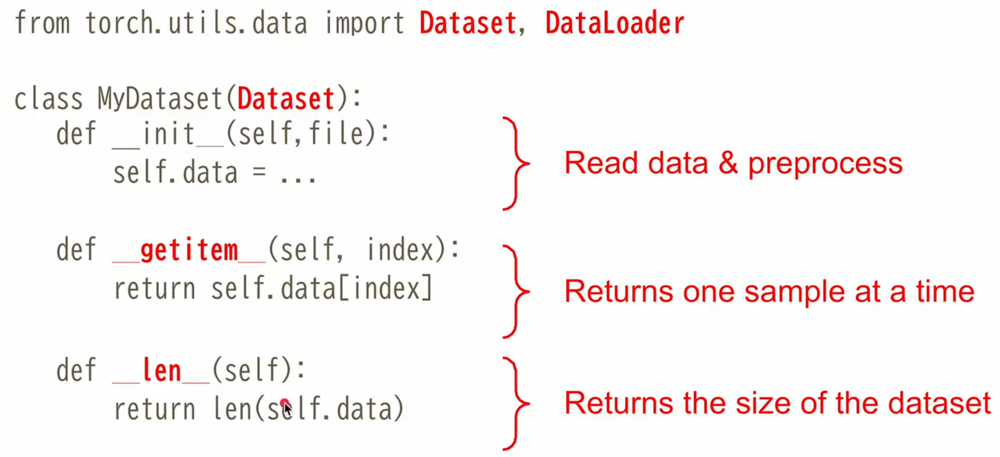

# What is PyTorch

PyTorch 是一个 Python 的机器学习框架。也就是它能提供一个比较方便的方式帮助我们训练模型。

其特点是，在GPU上使用一个高纬的 Tensor 计算，可以帮我们加速在训练模型中的各种运算。并且它提供 「Automatic differentiation, AD, 自动积分 」, 在深度学习中, 自动微分常用来计算每个模型参数的「梯度，Gradient」, 以更新参数。 

# Training Neural Networks

训练一个模型的时候，需要三个组件。首先，要定义一个神经网络(Define Neural Network), 然后要有一个损失函数(Loss Function)，最后还要有一个优化算法(Optimization Algorithm).



训练和测试时的工作流是首先训练一个模型，然后 Validate 它的效果，如果不够好就会继续训练。等到模型达到上限或可以产出的程度，我们就会测试。

在测试或者验证时，需要 Load Data, 即把训练数据或者验证数据，加载到系统里面，让模型可以读取。这就会用到 Dataset 和 Dataloader 两个部分。



Dataset 会储存数据样本(data samples) 以及期望值(expected values)
Dataloader 会把数据组织成 batches, 使得数据可以被并行处理。
它的典型使用方式为：

```python
dataset = MyDataset(file)
dataloader = DataLoader(dataset, batch_size, shuffle=True)
```

注意最后一个参数 shuffle，训练的时候，一般把它设为 True，但是在推理的时候，就把它设为 False。



这是 Dataset 通常的使用格式。我们首先需要从 torch.utils.data 引入 Dataset 基类，我们继承它然后编写自己的 MyDataset。在构造函数 `__init__` 中，我们要读入所有的数据，并且把预处理数据过程自己写出来，即 Read data & preprocess。`__getitem__` 是告诉模型如何获得 data, 传入的 index 是告诉函数，取得第几个数据，这些数据在 init 中已经读入了 self.data, 取得数据是从这里面获取。len 就是返回 self.data 中有多少个数据。getitem 和 len 在 DataLoader 中会使用到。


一个 Dataloader 会以一个 dataset 为基础。当 Dataloader 去取出一个 batch 的资料时，假设 batch_size 设定为 5，它就会执行 getitem(0) ~ getitem(4) 的操作，然后把取出的数据，放在一起形成一个 mini-batch。

>-  Dataset 和 Dataloader 的架构是因为我们数据集可能非常大。数据是存储在磁盘上的。内存容量可能无法放入全部数据。因此，Dataset 放在磁盘上，DataLoader 可以每次读取一定的数据到内存里，这样能够保证所有的数据都可以提供给模型训练，而不是被内存大小限制。

# Tensor

Tensor 是 PyTorch 里所有运算的基本单位。Tensor 可以简单理解为各种维度的矩阵和向量。


### Shape

Tensor 里面很重要的一个概念就是 shape。shape 简单说，n 阶张量在每一个维度上有几元素，Shape 描述的就是一个张量的形状，不涉及各分量具体的值。


> [!NOTE] 注意⚠️：Shape 只是描述是张量形状
> - Shape 描述的是张量是有几个维度, 张量中叫「阶」，每个维度上各有多少个元素，它代表的是元素的数目，不是元素的值。
> - 上图最左边代表一阶张量，dimension 为 5，表示这个张量在第1维度上有 5个元素。中间代表二阶张量，第一个维度 dim 0为 3,  第二个维度 dim 1 为 3。表示在第一个维度上有 3 个元素，第二个维度上有 5 个元素。最右表示三阶张量，第一维度上 dim 0 有 3 个元素，第二个维度上 dim 1 有 5 个元素，第三个维度上 dim 2 有 3 个元素。

<u><b>其实一个张量的 Shape 从左往右，可以看作是这一维度上，包含了多少个下面维度的张量。</b></u>

比如 Shape(3, 5), 可以看作二阶张量，第1维有 3 个元素，每个元素都是一个一阶张量的，也就是一维向量或数组，这个向量或数组有 5 个元素。

Shape(4, 5, 3) 从左往右，可以看做，这是一个 3 阶张量. 它的第 1 维是有 4 个元素，每个元素是 shape(5, 3)的张量，第二维是有 5 个元素, 每个元素是shape(3)的张量，或者说右 3 个元素的数组或向量组成。
我们可以更图形化的解释 Shape(4, 5, 3), 这个张量有 4 层高，每一层是一个二维矩阵，矩阵有 5 行，每一行有三列。

> 总结：Shape 是描述张量的具体形状的，比如这个张量在每一个维度上有几个元素，长宽高是多少。它不管具体分量的值。

### Creating Tensors

在 PyTorch 中有几个常见的创建张量的方式。可以从 list 或者 numpy.ndarray 来创建 Tensor.


我们在训练过程中，可能常常需要使用全0 或 全1 的 tensor。我们可以使用 `torch.zeros()` 和 `torch.ones()` 来构造，但是他们的参数与前面的 torch.tensor()，torch.from_numpy() 的方法不一样。它传入的参数不是具体数据，而是 tensor 的 shape。

### Tensor Common Operations

Tensor 常用的运算包括

`◼︎`Additon, Subtraction, Power, Summation, Mean.加、减、阶乘、求和、求平均


两个 tensor 进行加和减的时候，要求他们的 Shape 要是一样的，操作是将两个tensor 上对应的元素相加或相减。pow 是对 tensor 里面的每一个元素的值做 power 运算。sum 就是将 tensor 的所有值加起来。mean 就是将整个 tensor 的所有值取平均。

`◼︎` Transpose 转置

Tanspose 转置操作，是交换两个特定的维度


transpose(0, 1)，表示要交换第 0 个 dimension 和 第 1 个 dimension. 上图中的例子，就是一个 2 x 3 的矩阵进行转置 Transpose, 变成了一个 3 x 2 的矩阵。

`◼︎` Squeeze 与 Unsqueeze

训练过程中，有时会产生额外的 dimension (需要降一个dimension) 或者希望将数据提升一个 dimension，让数据符合输入输出格式。


squeeze 在某个维度是只有1个元素的情况下，即 Shape 在这个维度下的值是1.将其维度信息挤掉，因为在这个维度上只有 1 个元素，维度信息在这个 tensor 上是没有用的。 上图中第 0 维只有一个1，它不包含任何信息，所以可以挤掉。

unsqeeze 执行的是相反的操作


无论是 sqeeze 还是 unsqueeze, 传入的参数都是 dimension. 指定挤压掉哪个dimension 或 者指定哪一个 dimension 为1，后续的 dimension 依次后移，这样提升 1 个阶或维度。

`◼︎` Cat: Concatenate

有时我们需要把多个 tensor 连接在一起。


cat 的操作，要求我们指定一个 dimension, 并且连接的 tensor 其他地方维度必须相等，否则就会报错。上图我们要 cat 第1个 dimesion, 就要求其他的dimension 必须相等。

# Gradient Calculation

比如有一个 Tensor 如 ① 所示，我们要对它做 pow(2) 再做 sum 的操作，得到 z ②，我们希望 z 能够做 backpropaganda，也就是要让 z 对 $x_{i,j}$ 做偏微分。得到然后对它做偏微分 ③。然后得到 ④ 的数值。


z.backward() 计算出来以后，它会把 x 的偏微分结果放在 x.grad 里。这个gradient 的 tensor 就能够在训练模型的过程中，进行 backpropagation.
# Data Type

当我们进行计算的时候，数据格式必须匹配，否则可能会造成错误的产生。


pyTorch 和 Numpy 有一些相似属性


# Device

我们在创建一个 tensor 的时候，默认情况下，它是会放在 CPU 上，如果要让它放在 GPU 上就要使用 tensor 的 `.to()` 方法，将 tensor 移动到合适的设备上。
`·to()`中的参数 `'cpu'` 就表示把 tensor 放到 cpu 上计算(默认)，如果是`'cuda'` 就表示放到 NVIDIA GPU 上进行计算。


`torch.cuda.is_available()` 可以查看我们的计算机上是否有 NVIDIA GPU。如果有多张 GPU 在同一台机器上，设备名是 `cuda:0`, `cuda:1`, `cuda:2`.... 我们单纯些 `cuda` 的时候，它就等同于 `cuda:0`。


GPU 的优势是，其中有很多运算单元，可以让我们的计算并行化，加速我们的运算。

# Training & Testing Neural Networks

## 1. Definine Neural Network

在训练一个模型的时候，我们大致上使用 3 个步骤，定义一个神经网络，一个损失函数，还有一个优化算法。


我们在定义神经网络的时候，用到的是 torch.nn.Module 这个 library


「nn」 就是 「Neural Network」的意思。torch.nn 里面有很多种 Network Layers。Linear Layer, 也就是 Fully-connected Layer 是最常见的。Linear Layer 是用来将一个 Input Tensor 线性映射到另一个 output tensor 上。

上图中，输入是一个 tensor, 不管它是几阶张量，最后一个维度必须是 32，在经过一个 32 到 64 的 Linear Mapping 以后，它就会被转换为一个最后一个dimension 是 64 的 tensor。

input tensor 无论前面有几个 dimension, 每个 dimension 的长度是多少，最重要的就是最后一个 dimension 一定要是 32。上面的例子中输出的结果就是对应的(10, 64), (10, 5, 64), (1, 1, 3, 64)。

#### `◼︎`Linear Layer (Fully Connected Layer)


Linear Layer 做的事情，上图中，就是将输入 x1, x2, x3, 去对应乘以某些 weight, 得到结果之后再加上 bias。
这个操作可以把它写成矩阵的形式 「b + WX」，b 是偏移向量，W 是权重矩阵，x 是 Linear Layer 的输入。这个操作其实就是一个 「tensor 操作」，我们就可以利用 GPU 的并行加速来完成计算。


这里输入是一个 32 维的 tensor, 通过 weight 和 bias 的乘加，然后得到一个输出为 64 维的 tensor。这个计算就如上图的右边所示。

通过 layer.weight.shape 来找到 weight 的尺寸大小， layer.bias.shape 就可以找到 bias 的大小。


#### `◼︎`Non-Linear Activation Functions

在 torch.nn 里我们还会用到一些非线性的激活函数，比如 Sigmod 和 ReLU。在我们训练模型时，需要对模型增加一些 Non-Lineararity 的时候会用到。


#### `◼︎`Build Neural Network

当我们需要定义一个自己的模型的时候，我们需要从 nn.Model 继承过来。在我们自定义模型类的   `__init__` 里我们可以定义出 network 长什么样子。


上面的例子中，我们希望搭建一个多层模型。第一层是将 input 的 10 个 dimension，Linear Mapping 到 32。然后第二层经过 sigmod 函数，最后第三层把结果输出到一个 dimension 为1 的结果上。所以这个模型是有三层 Neural Network. 
因为模型有很多层，例如上面的三层，可以用 nn.sequential 这个函数，把多层Neural Network「包起来」，然后把它赋值给 self.net。

其他函数在调用模型的时候，它会找到 forward 函数，会将输入传递给 forward 函数。上面的例子中，forward 会把输入的 x 交给 self.net 处理，然后再 return, 所以输入的 x 会在 net 上来运算。
net 就会经过一个 Linear 操作，再经过一个 sigmoid, 最后再经过一个 Linear, 最后将结果 return 回去(就是中间 `nn.` 那三行代码)。forward 中就是定义 Input 该如何进行接下里的运算。

我们也可以不用 sequential 将多层 Neural Network 包起来。我们可以定义 `self.layer1`, `self.layer2`, `self.layer3`.


forward 里面就可以写成，输入的 x , 会经过 layer1，输出成 out. 再把 out 传递给 layer2, 输出成新的 out, 再把这个 out 传递给 layer3, 得到最终的 out。最后把这个 out 返回给使用者。

## 2. Loss Function

训练模型过程中，我们还需要 Loss Function, 会用到 torch.nn 下的 MSELoss 和 CrossEntropyLoss，等等。


「MSE(Mean Square Loss)」, 比较常用于 「regression task」 上。我们会定义一个 标准 `criterion = nn.MSELoss()`. 如果是一个 「classification task 分类问题」的话，我们比较常用的就是 「Cross Entropy Loss」, 定义的标准是 nn.CrossEntropyLoss().
然后，我们需要通过 criterion 计算出模型输出和期望值之间的差，即损失值，放在 loss 变量里面。

## 3. Optimization Algorithm

torch.optim 里面提供了一些 Gradient-based optimization algorithm，来帮助我们调整参数，降低损失值。


最常见的就是 Stochastic Gradient Descent(SGD). 上面定义了一个 SGD 的 optimizer。它的用法是我们需要告诉 optimizer 模型参数 `model.parameters()`是什么, 然后需要指定 learning rate, 还有 momentum 的参数。


这样，我们就得到一个 optimizer. 对于每个 batch 里面数据，会做如下操作
- 调用 `optimizer.zero_grad()` 把 optimizer 里面的 gradient 全部清除。也就是将所有 model 参数累积的 gradient 全部清除。
- 然后使用 `loss.backward()` 做反向传播 backpropagation, 把 loss 一路回传到模型的每一层参数。
- 使用 `optimizer.step()` 的方式调整模型的参数内容。

## 4. Entire Procedure

我们训练一个模型的完整流程如下：


◼︎<b>S1：Training Setup</b>


> [!NOTE] 训练过程 Setup 步骤
> - 第一步，会有一个 dataset。通过自定义数据集类传入一些数据文件，把它定义成 dataset 对象。
> - 第二步，data loader 会把 dataset 训练数据按照给定的 batch(上面是16)大小，load 成一个一个的batch，在上面 train_loader 中。
> - 第三步，定义模型，并且把它搬到我们想要运行的 device 上面。
> - 第四步，设置 Loss Function 的 criterion.
> - 第五步， 创建 optimizer, 传入模型参数，设置 learning rate(上面是0.1).

◼︎<b>S2: Training Loop</b>

真正开始训练的时候，训练循环(Training Loop)就会如下：


首先需要定义模型需要训练几个 epoch，也就是模型全程会学习全部的dataset 几遍。model.train 是用来把 model 设为 train mode。
最核心的是 for 循环，train_loader 会从 dataset 里面以一个 batch 一个 batch 的方式，把数据取出来后，放进对应的 x 和 y 里面, x 就是我们输入的问题， y 就是答案。
x 和 y 拿到训练数据后，我们会先清空 optimizer 里面的 gradient, 然后把 x 和 y 移动到 device 上面。这里注意⚠️，x , y 和 model 要在同一个 device 上面才能正确进行运算。
然后，我们会将 x 放到 model 里面去运算出一个 prediction。prediction 的结果会去跟 y 做 loss 运算，即对定义好的 criterion 传递模型输出的 prediction 和 y (dataset 里提供的参考答案)。这样算出来的 loss 再进行 backward propagation,反向传播. 把 gradient 传回到模型参数的每一层以后，我们就执行 optimizer。step() 真正去更新和调整模型的参数。

◼︎ <b>S3: Validation Loop</b>

训练到一定阶段以后，我们需要对模型进行评估 evaluation. 评估的时候，重要的一点是 evaluation 的 Loss. 我们可以通过观察 evaluation 的 Loss，来观察模型训练的效果，检验是否有 overfitting 过拟合的产生。


for 循环的流程和 train 的流程就比较类似。通过 val_loader 读出验证集(validation dataset)上的 input 和 output 对，然后把 x 和 y 搬到对应 device 上。

注意⚠️:这里是用了 `torch.no_grad()` 关闭 gradient 计算，因为做 validation 的时候，我们不希望模型参数被改动， 所以我们先把 gradient 的功能关闭。

接下来，同样把 x 传递给模型，模型产生一个 predicition, 然后用 predicition 和 验证集上的答案 y ，通过 criterion 算出它们之间的 Loss. 把全部 Loss 加起来之后，再计算平均。这个平均的 Loss 就可以帮助我们观察训练效果如何。

◼︎ Testing Loop

确定已经训练完成以后，我们需要做 testing。testing 的过程是没有答案的， 所以 Testing Loop 里面是没有 y 的。


我们需要把所有的结果都存起来，所以用一个 preds 的列表，把所有模型输出的测试结果存起来。同样的步骤，把 x 搬到 device 上，关闭 gradient 计算。然后把输入 x 放到 model 里面，得到输出。最后把这个输出搬到 CPU 上，然后 append 到 CPU 上的列表 preds 中。

其中值得注意的是 `model.eval` 和 `with torch_grad()`.


model.eval() 会把 dropout layer 和 batch normalization 的功能关闭，改变模型里面一些层的行为。而 torch.no_grad() 主要是避免模型计算 gradient，然后反向传播 gradient 到各层去修改参数。
# Save / Load Model


当模型训练好了，或者训练一半的时候，我们可能想要把它存起来。调用model.state_dict() 可以取出模型里面所有的参数数据，并且指定一个 path 告诉它要存储在哪里。

Load 的时候，我们就可以把上面 Save 的路径传给 torch.load(), 它就会被存成一个 check point(ckpt)。然后再调用 model.load_state_dict(ckpt) 的方式汇入model.

这个方式比较常用，因为我们并不是要存最后一个 epoch, 而是要存储中间 Loss 最小的 epoch 结果。所以在每次 epoch 完成后，我们可以判断，这个 epoch 要不要存起来。