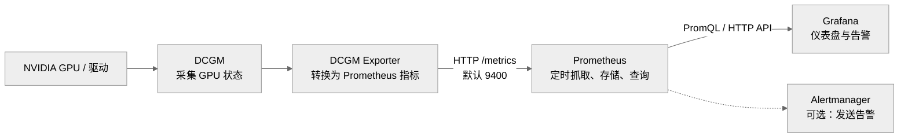

# 1. Exporter

Exporter 是 Prometheus 中的一个组件类型/设计模式。它是一组接口，Prometheus Server 定期访问这组接口，抓取数据。Prometheus Server 在抓取数据的时候，都是通过统一的接口，指标格式去抓取。Exporter 是 Prometheus 生态中的一种角色或设计规范，是一个通用概念，是 Prometheus 指标的暴露规范。不同的具体实现都要遵循 Exporter 的接口规范，它类似于协议。

Exporter 有各种不同的具体实现，这些实现的本质是，不同的数据源 和 Prometheus 之间的适配器。比如下面就描述了不同的数据源对应于不同的 Exporter。

```
Exporter（通用概念）
├── Node Exporter：导出主机 CPU、内存、磁盘指标
├── MySQL Exporter：导出 MySQL 指标
├── Blackbox Exporter：导出网络探测指标
└── DCGM Exporter：导出 NVIDIA GPU 指标
```

- <u>Node Exporter</u> : 负责将 Linux 的 CPU，磁盘，内存等监测数据，转化为 Prometheus 的数据格式和访问接口，把这些数据按照 Prometheus 指标格式暴露在 HTTP `/metrics` 接口处。Node Exporter 组件是由 Prometheus 项目维护，主要是提取 Linux 操作系统的主机指标。
- <u>MySQL Exporter</u> : 主要提供 MySQL 数据库服务器的状态和性能指标。
- <u>DCGM Exporter</u> : 是由 Nvidia 提供的连接 DCGM 和 Prometheus 的适配器，主要负责将 DCGM 从 GPU，驱动及其相关组件中的获取的状态数据，转化 Prometheus 的指标格式和接口。

<b>它们更像是不同设备的适配器，虽然输出端都采用相同标准，但输入端和输出的具体指标不同.</b>

```
NVIDIA GPU ── DCGM Exporter ──┐
Linux 主机 ── Node Exporter  ──┼── /metrics 标准 ── Prometheus
MySQL ─────── MySQL Exporter ─┘
```

```
GPU / Linux / MySQL
        ↓ 获取原始状态数据
对应的 Exporter
        ↓ 整理为 Prometheus 指标格式
HTTP /metrics
        ↓ 定期抓取
Prometheus Server
```

> 总结：不同 Exporter 从各自的数据源采集指标，并通过统一的 Prometheus 格式在 `/metrics` 接口上暴露，使 Prometheus 能用同一种方式抓取不同系统的监控数据。
# 2. DCGM / DCGM-Exporter

DCGM, NVIDIA Data Center GPU Manager, 由 NVIDIA 提供，运行在 GPU 服务器上。它负责从 NVIDIA GPU，驱动以及相关组件中获取状态。例如， GPU利用率，显存使用量，温度，功耗，频率，PCIe, NvLink, NvSwitch 等等状态信息。

但是这些数据要能够被 Prometheus 抓取，就必须要将其转换成 Prometheus 的数据格式和接口。中间的这个数据转换的接口或者适配器就是 DCGM-Exporter。它的工作流程如下：

```
Prometheus
    │  HTTP GET /metrics
    ▼
DCGM Exporter
    │  调用 DCGM API
    ▼
DCGM
    │
    ▼
NVIDIA GPU
```



DCGM 是在 GPU 数据采集和管理这一层，它负责从 NVIDIA GPU，驱动，以及相关组件中获取状态，例如：GPU利用率，显存，温度，功耗等等数据。DCGM 不只是监控工具，它还提供了配置管理，健康检查，诊断，策略等功能。

DCGM-Exporter 是指标转换层。Prometheus 通常不会直接读取 DCGM，而是访问 DCGM-Exporter。它的主要功能是将数据转换为 Prometheus 格式。然后通过 `HTTP /metrics` 接口对外提供，默认端口是 9400。

DCGM / DCGM-Exporter 都是由 NVIDIA 提供和维护。DCGM 可以独立运行，它主要是获取和管理GPU 状态。DCGM-Exporter 也可以单独部署，但是它依赖 DCGM 的能力，因为它主要是把 GPU 数据转换为 Prometheus 格式。在 Kubernetes 环境中，NVIDIA GPU Operator 可以统一管理驱动，DCGM 和 DCGM Exporter, 但是 Prometheus 和 Grafana 仍然属于独立的监控系统。

# 3. DCGM-Exporter 的 Docker 镜像

DCGM / DCGM-Exporter， 通常是放在容器中，在整体系统架构中，用 docker compose 进行容器服务的编排。NVIDIA 提供的 Docker 基础镜像是 `nvidia/dcgm-exporter:latest`。这个镜像内部，已经包含了 DCGM 库，所以大多数情况下，我们不需要独立再运行一个 DCGM 服务。

`dcgm-exporter` 在没有设置 `--remote-hostengine-info` 的时候，会通过 libdcgm, 在自身进程内部启动一个 embedded host engine.  `count: all` 参数配置将宿主机的所有 GPU 暴露给 dcgm-exporter 容器。`SYS_ADMIN` 主要用于访问部分 `DCGM_FI_PROF_*` 性能指标。

NVIDIA 的官方文档说明，未指定远程 host engine 时，exporter 会初始化内嵌的 DCGM, 只有指定 --remote-hostengine-info 时，才连接单独运行的 nv-hostengine.

整体的运行链路是

```
宿主机 NVIDIA 驱动 / GPU
          ↓
容器内 libdcgm + embedded host engine
          ↓
dcgm-exporter
          ↓
http://dcgm-exporter:9400/metrics
          ↓
Prometheus → Grafana
```

因此，宿主机仍然需要具备，NVIDIA驱动，Nvidia-Container-Toolkit。

---
### 附： 查阅

| ✅   |     |
| --- | --- |
|     |     |
