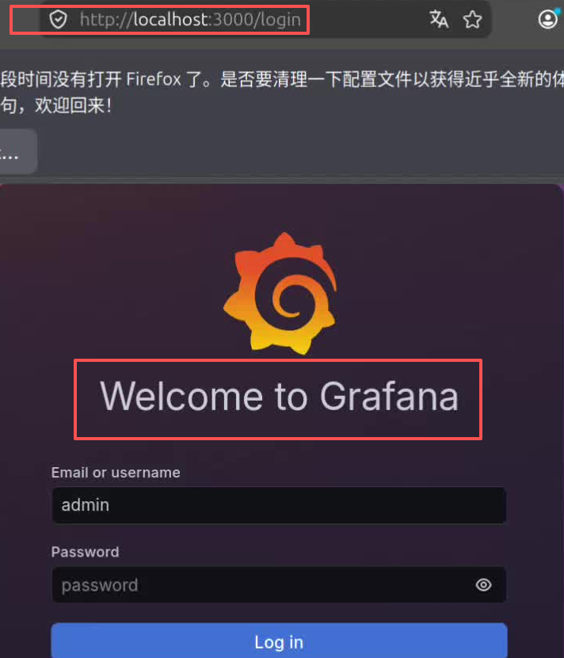

在 Prometheus 配置好目标数据源之后，Grafana 直接访问 Prometheus, 使用 PromQL 从 Prometheus 服务器上查询指标数据。

Grafana 的工作原理，及其与 Prometheus 之间的交互方式，详见 [Grafana](vLLM/monitoring/Grafana)

Grafana 服务启动之后，我们通过浏览器进入 Grafana UI, 默认是 http://locahost:3000. 在 Grafana UI 下，配置 Prometheus 数据源。 Grafana 会访问 Prometheus 数据源，查询需要的指标数据。然后设计展示数据的 Dashboard ，设置 Row, Panel, 查询，样式，调试 PromQL等。

在 Grafana UI 中设置的配置，保存时默认写入本地的 Grafana 数据卷，`grafana_data` 对应数据库文件 `var/lib/grafana/grafana.db`。重启 Grafana 时，就可以通过  grafana_data 恢复配置。但是，只要本地卷删除后，dashboard 和 prometheus 数据源等信息就会丢失。这种方式更适合一直依赖 grafana_data 保存 UI 配置， 并且不需要自动部署的情况。本地卷与容器挂钩，一一对应。因此它不具备复用的通用性。另外，不特别指定，容器消亡的时候，就会顺带删除本地卷。

自动化部署时，Grafana 使用三个核心配置文件自动部署或重构 Grafana 容器。`prometheus-datasources.yml`, 负责指定 prometheus 数据源，Grafana 直接从数据源查询数据。Dashboard JSON 负责存放 Panel 的设置。provider.yml 指定 Dashboard JSON 的位置。三个配置文件都指定放在 `provisioning/` 子目录下，这种配置方式也叫做 provisioning 配置方式。

我们结合两种，采用一种更通用的 Grafana 配置方式，先用 Grafana UI 配置 Panel, 填写相关 PromQL, 设置图表图例等。再导出 Dashboard JSON，保存为 heteroserve.json, 然后再编写 prometheus-datasources.yml 和 provider.yml，放在指定位置。

Grafana 在任何地方部署, 用这三个配置文件, 就能自动部署和恢复同样配置的 Grafana 看板系统。

# 1. Grafana UI 配置过程

compose.yml 中，我们已经配置了 Grafana 容器的密码 `GF_SECURITY_ADMIN_PASSWORD=admin`，默认用户名密码就是 admin/admin. Grafana 服务的监控端口是3000，所以我们在浏览器中先访问 Grafana 主页


登陆之后，可以看到下面的界面


至此，我们就可以在 Grafana UI 中，配置 Dashboards 了。

Grafana UI 中的 Dashboards 下面有若干行 Row. 一行下面有若干个面板 Panel，一个面板可以理解为一个图示单元(坐标图，柱状图，状态图等)，下面可以有若干 PromQL，每个 PromQL 返回一个或多个时间序列。

对 Grafana 的层级可以理解为

```
Dashboard
└── Row（分组/布局容器）
    └── Panel（具体图表或数值卡片）
        └── Query（一个或多个 PromQL）
```


# 2. Grafana UI 设置 Dashboard 样式

我们在 Grafana UI 中，配置 Panel 查询并展示相关指标数据。我们将 Grafana UI 分成四行来展示。
四个 Row 完整的 Panel 参考下面的布局

Grafana UI 配置完成后，我们使用 Grafana UI Export, 将配置导出为 Dashboard JSON 文件 `heteroserve.json`。

Gafana 面板中的布局和配置如下：

### 第一行：吞吐与延迟

分为 5 个 Panel。分别展示 Prompt 吞吐量 , Generation 吞吐量两个 Query.  TTFT , TPOT, 和 E2E 的 P95 / P99. vllm 处理请求的速率。

配置第一行完成后，我们看到的效果为：


### 第二行：Scheduler 与 KV Cache

分为 4 个 Panel, KV Cache 使用率，Running/Waiting 请求数, Preemption, Prefix Cache 命中率。可以选择性加入第 5 个 Panel, 进一步分析产生排队的原因。
配置第二行完成后，我们看到的效果为：


### 第三行：GPU 健康 (DCGM)

反映 GPU 的健康程度，分为 5 个 Panel, GPU 利用率，显存使用率，GPU 温度， GPU 功耗，DCGM 抓取状态。
配置完第三行后，我们看到的效果为：


我们刚完成系统启动，并没有任何的请求或推理的任务被处理。vllm 只要正常启动，就会进行显存的预分配和占用，所以看到显存占用率都是超过 80%。GPU的温度和功耗，除了模型刚启动的时候，有一个峰值，之后就迅速回归闲置(idle)状态, 温度在 30 摄氏度，功耗在 0w~20w 之间，这都是正常的。

### 第四行：Nginx 业务层

HTTP 访问数据指标的展示，分为 5 个 Panel,  Nignx 请求总数，请求速率，HTTP成功率， HTTP 5xx 错误率， Nginx 连接状态。


# 2. Dashboard JSON 导出

设计完后从 Grafana UI：Share → Export → Save to file，存到 `deploy/grafana/dashboards/heteroserve.json`, 即 Dashboard JSON 文件

将 Dashboard JSON 的路径 deploy/grafana/dashboards/ 放入 provider.yml, 让 Grafana 知道到哪里去找 Dashborad JSON 文件 heteroserve.json. 

Dashboard Provider YAML 配置文件，如下：

 ```YML
apiVersion1

providers:
	- name: HeteroServe
	folder: HeteroServe
	type: file
	disableDeletion: false
	editable: true
	options:
		path: /etc/grafana/provisioning/dashboards
 ```

 Dashboard Provider YAML 配置文件中，最核心的配置项就是 options.path。
 这里的路径 `/etc/grafana/provisioning/dashboards`, 是容器中的路径，我们挂载的宿主机的路径是 `./deploy/grafana:/etc/grafana/provisioning:ro`, 所以 path 对应的宿主机路径就是 `./deploy/grafana/dashboards/`。

此外，还需要配置 prometheus 数据源，在 `/datasources/prometheus-datasources.yaml` 中配置, 告诉 Grafana 数据源的地址。

```yml
apiVersion1
datasources:
	- name: Prometheus
	  uid: Prometheus
	  type: Prometheus
	  access: proxy
	  url: http://prometheus:9090
	  isDefault: true
```

Grafana 会访问 http://prometheus:9090 去读取 prometheus 指标数据，然后按照 Dashboard JSON 的配置展现出来。

# 3. Grafana 自动化部署与配置恢复

导出 Dashboard JSON 文件 heteroserve.json 之后，我们就可以通过配置 Grafana provisioning 目录结构，实现 Grafana 重复部署和自动恢复全部配置。

Grafana 使用的配置文件是`provisioning/datasouces/` 下的YAML文件, 负责提供 prometheus 数据源的地址；`provisioning/dashboards/`下的 Dashboard Provider YAML, 负责提供 Dashboard JSON 文件的路径；`heteroserve.json` Grafana UI 实际的配置文件。

我们在容器中进行了绑定挂载

```yml
volumes:
	- ./deploy/grafana:/etc/grafana/provisioning:ro
```

Grafana 服务启动时默认访问 provisioning 目录时，就会映射到宿主机上相应的目录中读取。Grafana 自动配置 prometheus 数据源，加载 Dashboard JSON 配置文件。在浏览器访问 Grafana 的时候，Grafana 后端就会向 Prometheus 数据源发出查询请求。返回查询结果后，Grafana 就会进行渲染，在 Grafana 面板中展示出来。 

总结： Grafana 的三个核心文件

>- prometheus 数据源配置文件
>- Grafana Dashboard Provider
>- Grafana Dashboard JSON

---
### 附：查阅

| ✅   |     |
| --- | --- |
|     |     |
