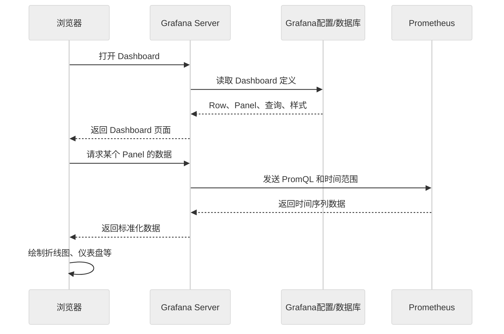

Grafana 是一个查询编排器 + 数据可视化前端 + 看板配置管理系统。它不负责采集和长期保存监控指标，也不负责执行 PromQL, 这些是 Prometheus 要完成的工作。Grafana 的工作流程如下：



Grafana 启动后，会读取 `/etc/grafana/provisioning/`, 这个文件夹下主要包括三个子文件夹
`.../provisioning/datasources/`,  `.../provisioning/dashboards`, `.../provisioning/alerting/`, 

这三个文件夹下，有 Grafana 需要的三个核心的配置文件，`/datasources/prometheus-datasources.yml`, `/dashboards/provider.yml`, `/alerring/alert-rules.yml`, 

prometheus-datasources.yml 定义prometheus的数据源，provider.yml 配置，告诉 Grafana 去哪里找 Dashboard JSON文件。alert-rules.yml 定义警告规则，联系点和通知策略。

# 1. datasources / prometheus-datasources.yml

这里的 prometheus-datasources.yml 和 Prometheus 中的 prometheus.yml 是两回事。这里的prometheus-datasources.yml 是告诉 Grafana, 到哪里去如何连接 Prometheus。而 Prometheus 配置文件 prometheus.yml 是告诉 Prometheus 要去抓取哪些服务的指标。两个文件是完全独立的。
# 2. dashboards / provider.yml

dashboards 目录下的 provider.yml 文件主要告诉 Grafana 到哪里读取 Dashboard JSON.

# 3. Dashboard JSON 

Dashboard JSON 是一个通用的概念，实际对应某个 JSON 文件。文件名可以自定义，比如 heteroserve.json。该文件内容是有效的 Grafana Dashboard JSON, 文件位于 provider.yml 文件中的 options.path 指定目录中，比如指定

```yaml
options:
	path: /etc/grafana/dashboards
```

这个目录下，可以有多个看板，即多个 Dashboard JSON
```yaml
/etc/grafana/dashboards/
├── heteroserve.json
├── vllm-performance.json
└── gpu-health.json
```

Dashboard JSON 文件中是定义 Grafana 要实际展示的内容和格式，保存的是 PromQL 内容,包括：

```
Dashboard标题和UID
Row和Panel
Panel位置、大小
PromQL查询
数据源UID
单位、图例、颜色
阈值
变量
时间范围和刷新周期
```

此外，alerting 不是必须的，它是一个可选项。是否配置不影响 Grafana 连接 Prometheus。

# 4. Grafana 的核心配置

Grafana 的核心配置文件就是三个
> prometheus-datasources.yml
> provider.yml
> Dashboard JSON(自定义名字)

Grafana 的工作流程是：

```
Grafana启动
    ├── 读取 prometheus-datasource.yml
    ├── 读取 provider.yml, 读取其中的 options.path
    └── 根据 provider.yml 加载 heteroserve.json
```

读取了 Dashboard JSON 之后，Grafana 读取数据的数据流是：

```
heteroserve.json 中保存 PromQL
        ↓
Grafana根据 datasource 配置访问 Prometheus
        ↓
Prometheus返回实时或历史指标
        ↓
Grafana按 JSON 中的 Panel 配置进行展示
```

> Grafana 工作的核心流程是，通过 datasource 配置访问 Prometheus. 把获得的 Prometheus 指标数据，按照 Dashboard JSON 中的配置进行展示。

# 5. Grafana 配置方式(一)：Grafana UI 配置

Grafana 服务正常启动后，我们可以通过浏览器访问默认的地址 http://grafana:3000 进入页面进行图形化配置。我们的配置步骤是：

> 1. 在 Grafana UI 首先配置  Prometheus Data source. 可以找到 Prometheus 数据源
> 2. 创建 Dashboard. 并创建 "第一行：吞吐与延迟"
> 3. 在一行中添加多个 Panel, 包括 Prompt 吞吐, Generation 吞吐, TTFT P99, TPOT P99, E2E P99
> 4. 为每个Panel 填写相应的 PromQL, 并设置图表类型，单位，图例等。
> 5. 创建第2，3，4行，以及其 Panel。
> 6. 保存 Dashboard. 通过 Grafana UI 导出 JSON，保存为 heteroserve.json. 即, Dashboard JSON

所以，我们在配置 Grafana 数据源，Dashboard, Panel 时，<u>不一定要手写上述的 Grafana 的三个核心配置文件</u>。可以直接在浏览器中配置。

我们在浏览器中配置的 Prometheus 数据源，创建的 Dashboard，添加的 Row 和 Panel, 填写的 PromQL 等等这些配置，只有我们收到导出 Dashboard JSON, 才会保存成 heteroserve.json. 这些信息默认保存到 Grafana 的内部数据库 `var/lib/grafana/grafana.db`，

所以在 compose 中配置 grafana 服务的时候，要指定挂载卷

```yaml
volumes:
	- grafana_data:/var/lib/grafana
```

只要 grafana_data 不被删除，重启或者重建容器，这些配置都在。

注意，这种方式将 Dashboard JSON，Prometheus-datasource.yml 和 provider.yml 中的信息都存放在 `grafana_data` 数据卷(本地数据库)中。重启Grafana的时候，就通过 grafana_data 就能恢复配置。

这种方式，适合一直依赖 grafana_data 保存 UI 配置，不要求自动部署。但是数据卷删除后，Dashboard 等信息就会丢失。

Grafana UI 可以将配置的 Dashboard 导出成一个JSON文件，就是 Dashboard JSON.

# 6. Grafana 配置方式(二)：手写配置文件

在多服务器下，需要重复部署，让 Grafana 启动后可以自动恢复全部配置。上面这种方式就不行了。我们需要自己提供配置文件：

```yaml
prometheus-datasource.yml
provider.yml
heteroserve.json
alert-rules.yml
```

这些文件的作用是让 Grafana 启动后可以自动恢复全部配置。这种方式，适合在多台服务器间重复部署，这些配置可以提交到 Git, 删除数据卷 `grafana_data`后仍然可以恢复(数据卷是绑定 Docker 容器的，随容器销毁，很可能被销毁，除非特意设置保留)，能保证测试和生产环境的看板一致。

# 7. Grafana 推荐配置方式

Grafana 比较推荐的配置方式是将上面两者结合起来。即在第一次启动配置 Grafana 的时候，在浏览器中配置 Promethus 数据源和 Dashboard, 并且调整验证 PromQL, 完成后导出 Dashboard JSON. 等到配置都稳定了之后，就手动编写 prometheus-datasource.yml 和 provider.yml 保存到对应的目录中。后续部署就可以自动加载

```
第一次：
启动 Grafana
→ 浏览器中配置数据源和 Dashboard
→ 调整、验证 PromQL
→ 导出 heteroserve.json

配置稳定后：
编写 datasource/provider YAML
→ 将 JSON 和 YAML 保存到项目中
→ 后续部署自动加载
```

所以，可以不手写 Dashboard JSON, 在 UI 中设计完成后导出。但是 prometheus-datasource.yml 和 provider.yml 仍然需要自己编写。Grafana 导出 Dashboard JSON 时，不会自动生成它。
因此，更推荐的部署方式是

```
先编写 prometheus-datasource.yml
→ 启动 Grafana
→ 使用固定 UID 为 prometheus 的数据源设计 Dashboard
→ 导出 heteroserve.json
→ 编写 provider.yml 自动加载该 JSON
```

# 8. 对比

Grafana UI 的方式配置面板，不需要上面三个配置文件，因为 Dashboard 的所有配置都在 Grafana 自己的数据库 grafana_data 里。它启动恢复时，依赖 Grafana 数据卷：

```
UI 配置
→ 保存到 /var/lib/grafana/grafana.db (grafana_data)
→ 重启时从 grafana_data 恢复
```

只要 `- grafana_data:/var/lib/grafana` 数据卷没有被删除，就不需要 YAML 配置文件。

使用 Provisioning 自动部署

```
prometheus-datasource.yml
→ 自动创建 Prometheus 数据源

provider.yml
→ 指定 Dashboard JSON 目录

heteroserve.json
→ 自动创建具体 Dashboard
```

> 第一次可以在 UI 中创建 Prometheus 数据源和 Dashboard，并从 UI 导出 `heteroserve.json`；如果希望在一个全新的 Grafana 环境中自动恢复，则需要另外手写 `prometheus-datasource.yml` 和 `provider.yml`。

实际操作中，最好先写很短的 `prometheus-datasource.yml`，固定：

```
uid: prometheus
```

再进入 UI 设计 Dashboard。这样导出的 `heteroserve.json` 会引用稳定的数据源 UID，迁移到其他环境时不会出现数据源匹配失败。


# 9. Grafana 默认目录结构

如果采取重复部署和自动恢复配置的方式。就要采用 Grafana 默认的目录结构。Grafana 服务在启动的时候，会自动到默认的目录中读取配置文件, 完成数据源的配置和 Dashboard 的加载。

Grafana 服务启动时会自动读取 `/etc/grafana/provisioning/datasources/`下的 yml 文件，以配置 prometheus 数据源。读取 `/etc/grafana/provisioning/dashboards/` 下的 Dashboard Provider YAML, 获取 Dashboard JSON 文件的路径。然后通过这个路径，加载 Dashboard JSON 文件。

Grafana 服务启动时，自动化部署和恢复步骤为：
1. Grafana 启动并执行 provisioning
   扫描 `provisioning/datasources/` 下的 yml 文件，根据 yml 文件创建或更新 prometheus 数据源配置。这一步是登记数据源，不是查询指标数据。 
2. 读取 Dashboard Provider
   扫描 provisioning/dashboards/ 下的 Dashboard Provider YAML，从其中的 options.path 找到 Dashboard JSON 文件。
3. 加载 Dashboard JSON
   按照 JSON 中的配置创建或更新 Dashboard 到 grafana 数据库。Grafana 读取 Dashboard Panel 中的 PromQL。
4. Grafana 面板展示指标数据
   当浏览器向 Grafana 发起访问的时候，Grafana 后端向配置好的 Prometheus 数据源提起询请求。查询结果返回后，面板渲染。自动刷新，时间范围变化，变量变化等都会导致重新查询。

简单归纳为：
```
启动阶段：
数据源 YAML → 注册/更新数据源
Dashboard provider YAML → 定位 JSON → 导入/更新 Dashboard

运行阶段：
打开 Dashboard → 解析面板 PromQL → 查询 Prometheus → 展示结果
```

>总结：Grafana 启动时根据 YAML 配置注册 Prometheus 数据源并导入 Dashboard JSON；当 Dashboard 被访问、刷新或自动刷新时，才根据 JSON 中的查询配置从 Prometheus 获取指标数据并在面板中渲染显示。

注意⚠️：<u>Grafana 对 prometheus 数据源配置文件，Dashboard Provider YAML, Dashboard JSON, 这三个核心配置文件的名字没有固定要求</u>。
Grafana 引擎只会读取对应目录，`provisioning/datasouces/` 和 `provisioning/dashboards/` 下的直接子文件，只处理 `.yaml` 或 `.yml` 文件。`datasources/` 中的 YAML 配置文件应包含 `datasources:` 等数据源配置内容。`dashboards/` 中的YAML 配置文件应包含 `providers:` 等 Dashboard provider 配置内容。

▪︎ <b>多配置文件</b>

`provisioning/datasouces/` 下可以有多个 YAML 文件，Grafana 会逐一读取。<u><b>Grafana 可以同时配置多个数据源，一个YAML下可以配置多个数据源，也可以在多个YAML中分别配置多个数据源。</b></u>

 `provisioning/dashboards/` 下也可以有多个 Dashboard Provider YAML 文件。Grafana 也会逐一读取多个 Dashboard JSON 文件，加载多个不同的 Dashboards。
 因此，Dashboard JSON 文件也可以有多个。
 
```
多个数据源 YAML
    → 多个数据源

多个 provider YAML
    → 多个 provider
    → 多个 Dashboard JSON
    → 多个 Dashboard
```


---
### 附：查阅

| ✅   |     |
| --- | --- |
|     |     |
